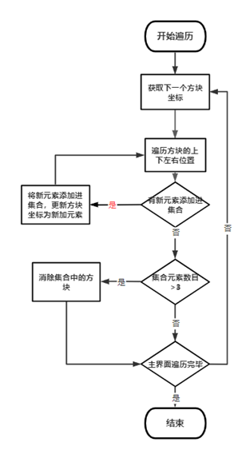
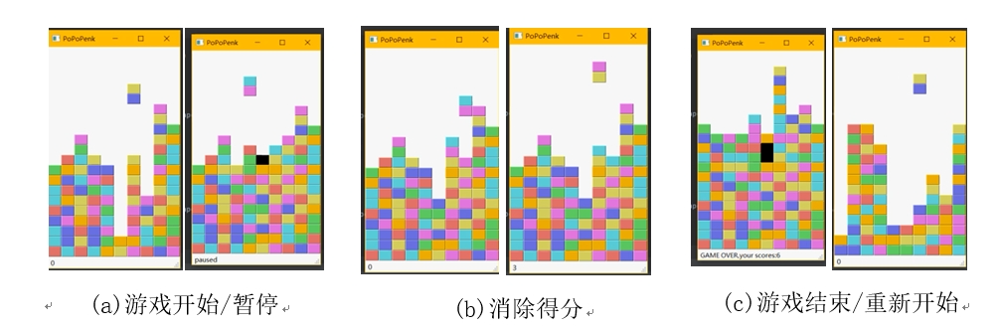

#PoPoPenk小游戏
##一、选题背景
在人们的日常生活中，除了工作、学习，玩自己喜欢的游戏正在成为一种时尚。大多数人肯定也玩过诸如俄罗斯方块、消消乐等经典小游戏。
受《英雄传说：零之轨迹》的内置小游戏“波波碰”启发，本小游戏将俄罗斯方块和消消乐相结合，使其更具挑战性和趣味性。
##二、方案论证(设计理念) 
###要实现的功能及其要求：
1）	小游戏拥有可操作界面，游戏开始时从随机生成初始状态，并且在程序顶部一次掉落一个随机2x1大小的双色方块
2）	游戏主要利用键盘操作，通过相应的按键进行操作，如通过小键盘的左右键操作下落方块运动的位置，空格可以让方块直接下落，P键可以进行暂停游戏，游戏结束可以按R键重新开始。
3）	方块一半触底后 另一半未触底可以直接下落。
4）	方块落下后，游戏界面中如果有连续3个或以上相同颜色方块则可以消去直到没有连续3个或以上相同颜色方块才开始掉落下一个方块。
5）	当下落方块方向下方方块叠满而阻止下一个方块生成时游戏结束
6）	游戏中可以统计玩家分数。
###运行环境：Windows 10
##三、过程论述
###项目程序主要由以下几部分组成：
	界面
	游戏事件
	方块定义
	方块运动
	方块的消除
###以下将对游戏各部分实现进行分析：
####1.	界面
项目主要采用Pyhton中的pyqt5库进行UI界面开发。
1）使用pyqt5组件设置UI界面
2）利用emit（）函数向主界面传参，实现游戏分数的实时显示：
3）利用QPainter对图形着色，实现方块的可视化
####2.	游戏事件
游戏事件主要利用pyqt5中的事件来实现，游戏事件包括如下：
1）初始化：主界面先随机生成方块，然后随机掉落方块。
2）按键事件：读取用户键盘输入调用相关函数
3）绘画事件：对界面进行重绘，如在方块下落时可以通过在方块坐标更新后调用update（）函数来唤醒绘画事件重绘方块，从而在主界面中实时显示处在新坐标的方块，即达到刷新画面的效果。
4）计时器事件：通过实现oneLineDown（）函数，结合timer组件，按一定事件间隔调用一次该函数让方块坐标更新一次（如x，y坐标加减一），使方块按一定速度下落。
####3.	方块定义
1）已下落的方块：
将游戏主界面视为一个m*n的矩阵，每一列为x坐标，每一行为y坐标，矩阵上的值对应该处的方块类型（0为无，1-7为不同颜色的方块），利用游戏事件的绘画事件根据对应数值采用1*7的颜色矩阵可视化方块。
2）下落中的方块
用2*2矩阵定义，方便进行旋转操作。将其封装成一个对象，并在主界面矩阵根据对象属性更新对应位置数值，利用绘画事件实时绘制下落中的方块，即每调用一次oneLineDown（）函数，就重绘主界面中的所有方块。
不同方向的方块
####4.	方块的运动
1）	方块的下落：
1.	下落通过实现oneLineDown（）函数，结合timer组件及tryMove（）函数判断方块触底，按一定事件间隔调用一次该函数让方块坐标更新一次（如x，y坐标加减一），使方块按一定速度下落。
2.	判断方块触底：通过实现tryMove（）函数，判断方块下一次移动的坐标中是否含有其他方块，若有，则停止下落。
3.	方块的继续下落，利用链表储存主界面每一列的方块信息（底部为链表首位），将空方块移到链表尾部以实现方块的继续下落。
2）	方块的直接下落
不使用timer组件,直接更新方块坐标，并在主界面重绘所有方块。
3）	方块的旋转
通过交换方块自身2*2矩阵中的x，y坐标实现。
4）	方块的生成
使用random库生成1-7随机的随机数，根据随机数对方块进行随即上色实现方块的随机生成。
####5.	方块的消除
遍历主界面矩阵一次，并遍历当前方块的上下左右位置，创建集合存储相同颜色的方块的坐标信息，利用集合的特性，只添加新坐标，然后遍历此集合里面的元素重复上述过程直到没有相同颜色方块添加进集合。
                
                       消除流程图
若集合元素数目大于三，则根据集合内的坐标信息将主界面矩阵对应元素设置为0以消除对应方块，同时根据消除的数量记录玩家分数。方块消除一遍后还要再继续遍历（防止有的方块继续下落进入可消除状态）直至不能消除。
##四、效果图

